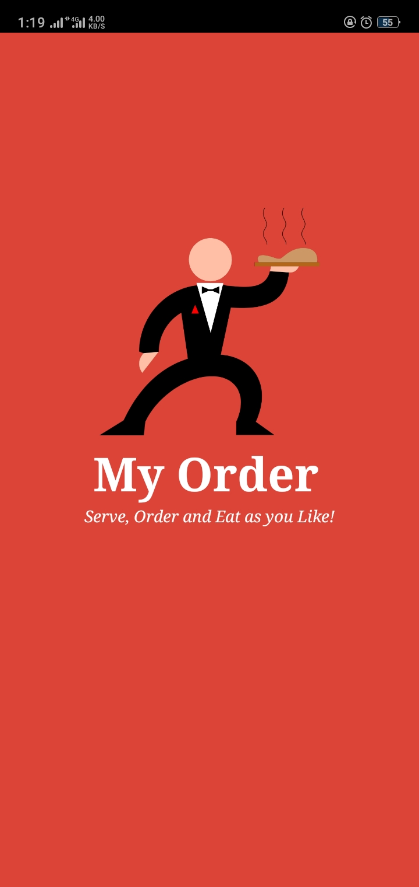
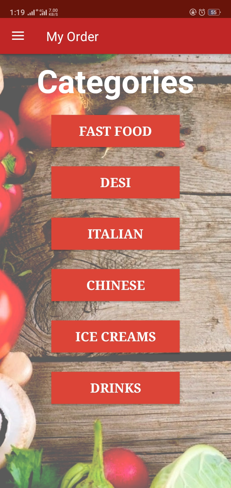
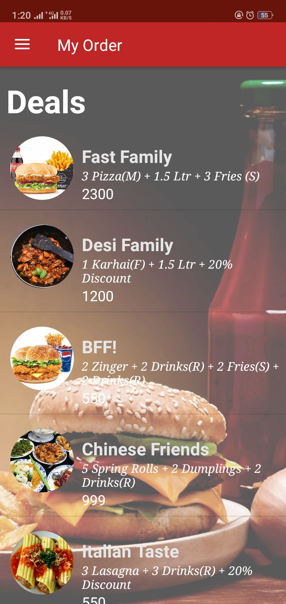
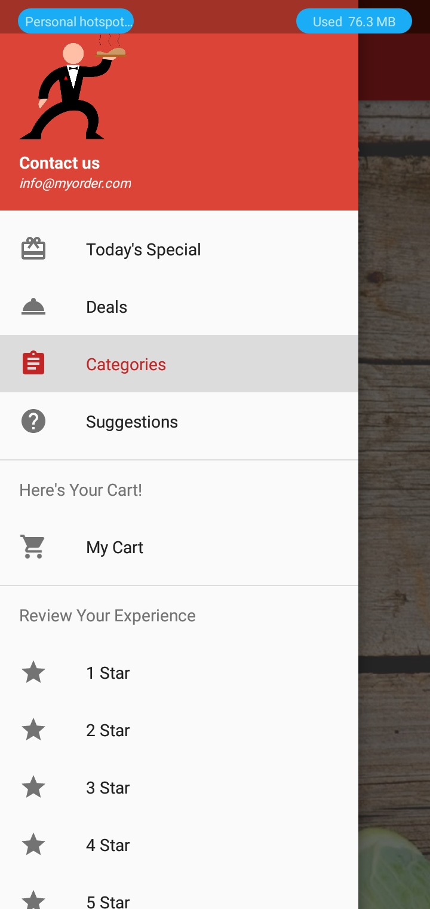
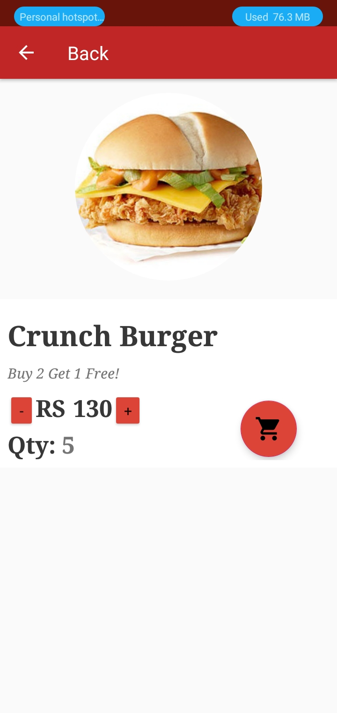
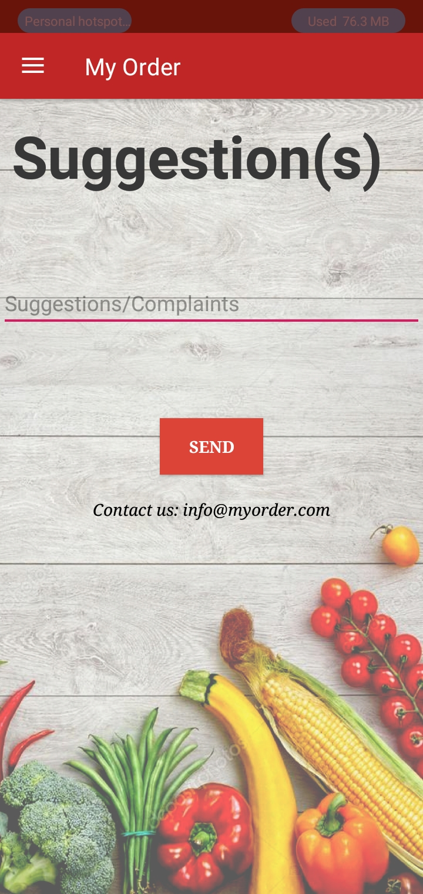
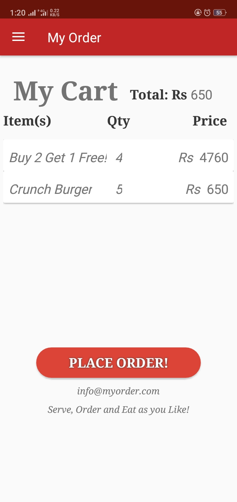
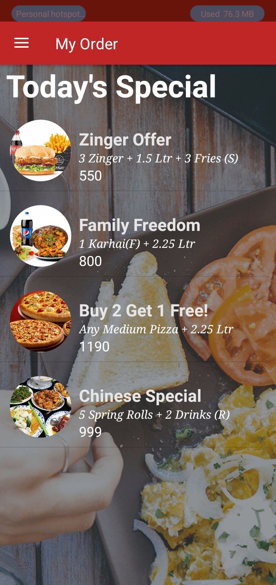

# My Order

It's a self service app. More like a Restaurant Ordering System

## Screen Shots

   
   

## Note
I developed it using JAVA and I'm not a Android Developer using Java anymore. So, there is some bug in Cart regarding total billing.

If you are interested feel free to update the git.